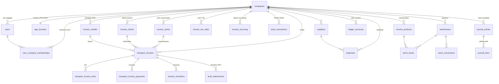

# facturamea.com - Schema bazei de date

> **Sursa de adevăr:** `src/db/schema-pg.ts` (Drizzle ORM). 85 de tabele.
> **DB de producție:** PostgreSQL self-hosted pe serverul Coolify (Netcup). Numele bazei: `facturamea`.
> **Model de izolare:** multi-tenant. Aproape fiecare tabel are `company_id` (firma = tenant). Datele unei firme nu se ating de ale alteia.
> **Monedă:** toate sumele sunt în **bani/cenți întregi** (`*_cents`, `INTEGER`), niciodată float - se evită erorile de rotunjire.
> **Chei primare:** `text` (id-uri generate de aplicație, nanoid), nu seriale.
>
> **Notă pentru expert (drift):** DB-ul live a fost construit inițial cu `drizzle-kit push`, apoi baseline-uit cu un journal de migrări. Există o mică abatere față de cod (ex: `audit_log.user_id` e `ON DELETE RESTRICT` pe live, dar `SET NULL` în cod). Schema de mai jos = definiția din cod.
> **Origine:** proiectul e clonat din TransportHub (bursă de transport), apoi dezbrăcat de modulele de transport. De aceea câteva tabele au nume „transport_*" deși sunt generice (vezi secțiunea Legacy), iar un grup de tabele transport au rămas în schemă dar **nu sunt folosite** de facturamea.

---

## 1. Identitate, autentificare și tenancy

| Tabel | Rol | Coloane cheie | Relații (FK) |
|---|---|---|---|
| `users` | Conturi utilizator | `email` (unic), `hashed_password` (bcrypt), `is_admin`, `totp_enabled`/`totp_secret` (2FA), `user_type`, `deleted_at` (soft-delete GDPR) | `company_id → companies` (SET NULL) |
| `companies` | **Firma = tenant.** Datele fiscale + branding factură | `cui`, `name`, `address`, `tva_at_collection`, `efactura_auto_send`, `cost_method`, `stripe_customer_id`, scoruri plată | - |
| `user_company_memberships` | Leagă user ↔ firmă cu **rol** (owner/admin/member). PK compus | `role`, `is_default` | `user_id → users`, `company_id → companies` (ambele CASCADE) |
| `sessions` | Sesiuni server (token `th_session`, hash sha256 în DB) | `expires_at` | `user_id → users` |
| `totp_pending_logins` | Handle 5 min între parolă-corectă și cod-2FA | `expires_at` | `user_id → users` (CASCADE) |
| `password_reset_tokens` | Reset parolă + **coduri de invitație membru** | `token` (unic), `used_at` | `user_id → users` |
| `email_verification_tokens` | Verificare email | `token` (unic), `used_at` | `user_id → users` |

---

## 2. Licențiere și plată platformă (modelul 700 RON lifetime)

| Tabel | Rol | Coloane cheie | Relații |
|---|---|---|---|
| `app_licenses` | **Poarta paywall-ului.** 1 rând/firmă. `plan` (trial/lifetime) + `status` controlează accesul în app | `plan`, `status`, `stripe_session_id`, `stripe_payment_intent_id`, `granted_by_admin_id` | `company_id → companies` (CASCADE, unic) |

> Acesta e tabelul care contează pentru facturamea. Plata 700 RON via Stripe → webhook scrie `plan='lifetime'`.

**Tabele de billing moștenite din TransportHub (prezente, dar NEfolosite de facturamea):**
`plans`, `subscriptions`, `billing_addresses`, `payment_methods`, `invoices` (facturare platformă veche, abonamente), `payments`, `coupons`, `company_licenses`, plus sistemul de credite `credit_balances` / `credit_transactions` / `services_catalog`. Le-am lăsat în schemă; nu sunt în fluxul activ.

---

## 3. NUCLEUL DE FACTURARE (inima produsului)

| Tabel | Rol | Coloane cheie | Relații |
|---|---|---|---|
| `transport_invoices` | **TABELUL DE FACTURI** (nume legacy, e generic). `kind` = factura / proforma / storno / chitanta | `full_number` (unic/firmă), `kind`, snapshot client (`client_name_snap`...), `subtotal_cents`/`vat_cents`/`total_cents`/`paid_cents`, `status`, `vat_regime`, câmpuri `efactura_*`, `bnr_rate`, `share_token`, `payment_link_*` | `company_id → companies`, `series_id → invoice_series` (RESTRICT), `client_company_id → companies`, `client_external_id → invoice_clients`, `model_id → invoice_models`, `order_id → orders` |
| `transport_invoice_lines` | Liniile facturii | `description`, `quantity`, `unit_price_cents`, `vat_rate`, `line_total_cents` | `invoice_id → transport_invoices` (CASCADE) |
| `transport_invoice_payments` | Încasări parțiale per factură | `amount_cents`, `method`, `received_at` | `invoice_id → transport_invoices` (CASCADE) |
| `invoice_series` | **Serii de numerotare** per firmă + kind. Numerotare secvențială fiscală | `prefix`, `kind`, `next_number`, `is_default` | `company_id → companies` (CASCADE) |
| `invoice_clients` | Clienți externi (firme neînregistrate în app) | `name`, `tax_id` (CUI), `is_vat_payer`, adresă, `iban` | `owner_company_id → companies` (CASCADE) |
| `invoice_products` | **Nomenclator** produse/servicii reutilizabile | `name`, `default_unit_price_cents`, `default_vat_rate`, `product_type` | `company_id → companies` (CASCADE) |
| `invoice_tva_rates` | Catalog cote TVA per firmă | `name`, `percent`, `regime`, `is_default` | `company_id → companies` (CASCADE) |
| `invoice_models` | Template-uri PDF (layout, culoare, logo, toggle-uri QR/expediție) | `layout_key`, `brand_color`, `show_qr`, `is_default` | `company_id → companies` (CASCADE) |
| `invoice_recurring` | Facturi recurente (cron auto-emite) | `frequency`, `next_run_at`, `lines_json`, `max_runs` | `company_id → companies`, `client_external_id`, `series_id` |
| `invoice_reminders` | Log dunning (notificări de plată) | `kind` (before/due/after), `sent_at` | `company_id`, `invoice_id → transport_invoices` (CASCADE) |
| `bnr_rates_daily` | Cache curs BNR zilnic (RON/valută). PK (data, valută) | `rate` | - |
| `fx_rates` | Curs FX generic (sursă ECB). PK (bază, cotată) | `rate`, `source` | - |

**Garanții de integritate fiscală (constrângeri pe DB):**
- `uq_transport_invoices_full` - număr unic per (firmă, full_number)
- `uq_transport_invoices_series_seq` - secvență unică per (serie, număr) → fără găuri/duplicate în numerotare
- `uq_transport_invoices_share` - token de partajare unic
- `series_id` e **RESTRICT** la ștergere → nu poți șterge o serie cu facturi emise

---

## 4. ANAF / e-Factura / e-Transport

| Tabel | Rol | Coloane cheie | Relații |
|---|---|---|---|
| `anaf_connections` | Token-uri OAuth ANAF per firmă (criptate AES-256-GCM). Access ~90 zile, refresh ~365 | `scope`, `cif`, `access_token_enc`, `refresh_token_enc`, expirări | `company_id → companies` (CASCADE, unic per scope) |
| `anaf_oauth_states` | Nonce CSRF pentru redirect-ul OAuth | `state` (PK), `expires_at` | - |
| `anaf_submissions` | **Audit fiscal** al fiecărui apel ANAF cu efect (upload factură, UIT, citiri) | `action`, `uit`, `spv_index`, `status`, `payload`/`response` (jsonb) | `company_id → companies` (CASCADE) |
| `efactura_inbox` | Facturi PRIMITE din SPV (B2B obligatoriu) | `anaf_msg_id`, `from_cif`, `supplier_name`, `xml`, `status` | `company_id → companies` (CASCADE) |
| `etransport_declarations` | Declarații UIT e-Transport | `uit`, `operation_type`, `vehicle_plate`, `goods_json`, `status` | `company_id → companies` (CASCADE) |

---

## 5. Cheltuieli și furnizori

| Tabel | Rol | Coloane cheie | Relații |
|---|---|---|---|
| `suppliers` | Furnizori (pentru cheltuieli + NIR) | `name`, `cui`, `reg_com`, `iban` | `company_id → companies` (CASCADE) |
| `expenses` | Cheltuieli (facturi/bonuri primite). Sursă: OCR sau import XML e-Factura | `category`, `document_type`, `net_cents`/`vat_cents`/`total_cents`, `deductible`, `attachment_url` | `company_id → companies`, `supplier_id → suppliers` |

---

## 6. Gestiune stocuri (inventar)

| Tabel | Rol | Relații |
|---|---|---|
| `warehouses` | Depozite/gestiuni (depozit/magazin/custodie) | `company_id → companies` |
| `stock_levels` | Stoc curent per (depozit, produs) + cost mediu. Denormalizat | `warehouse_id`, `product_id → invoice_products` |
| `stock_movements` | **Registru mișcări** (in/out/transfer/adjust) | `warehouse_id`, `product_id` |
| `receptions` | NIR - Notă Intrare Recepție | `warehouse_id` (RESTRICT), `supplier_id` |
| `reception_lines` | Liniile NIR | `reception_id → receptions` (CASCADE) |
| `stock_counts` / `stock_count_lines` | Inventariere fizică + diferențe | `warehouse_id`, `count_id` |
| `stock_lots` | Loturi + termen de expirare | `warehouse_id`, `product_id` |

---

## 7. POS (casă de marcat)

| Tabel | Rol | Relații |
|---|---|---|
| `pos_sales` | Bonuri/vânzări POS | `company_id`, `warehouse_id`, `invoice_id → transport_invoices` |
| `pos_sale_lines` | Liniile bonului | `sale_id → pos_sales` (CASCADE) |

---

## 8. Contabilitate (partidă dublă)

| Tabel | Rol | Coloane cheie | Relații |
|---|---|---|---|
| `ledger_accounts` | Plan de conturi RO (A/P/B/V/C) | `code` (4111, 707...), unic per firmă | `company_id → companies` |
| `journal_entries` | Note contabile (cap) - debit = credit | `entry_number` (unic/firmă), `total_debit_cents`/`total_credit_cents`, `source` | `company_id → companies` |
| `journal_lines` | Liniile notei (debit/credit pe cont) | `account_code`, `debit_cents`, `credit_cents` | `entry_id → journal_entries` (CASCADE) |
| `fixed_assets` | Mijloace fixe | `value_cents`, `useful_life_months`, `method`, `accumulated_cents` | `company_id → companies` |
| `depreciation_entries` | Amortizare lunară (1/lună/activ) | `period` (YYYY-MM), `amount_cents` | `asset_id → fixed_assets` (CASCADE) |

---

## 9. Comenzi (PO/SO), bancă, integrări, curierat

| Tabel | Rol | Relații |
|---|---|---|
| `purchase_orders` / `purchase_order_lines` | Comenzi furnizori → recepție stoc | `supplier_id`, `order_id` |
| `sales_orders` / `sales_order_lines` | Comenzi clienți → factură | `client_external_id`, `invoice_id → transport_invoices` |
| `bank_accounts` | Conturi bancare | `company_id → companies` |
| `bank_transactions` | Tranzacții importate (CSV/MT940) + reconciliere | `account_id → bank_accounts`, `matched_type`/`matched_id` |
| `integration_connections` | WooCommerce/Shopify/PrestaShop → auto-factură | `company_id`, `webhook_secret` (unic) |
| `shipments` | AWB curier (Sameday/FAN/DPD/Cargus) | `company_id`, `invoice_id → transport_invoices` |

---

## 10. Developer, admin, comunicare

| Tabel | Rol |
|---|---|
| `api_keys` | Chei API v1 (Bearer), doar hash sha256 stocat |
| `email_campaigns` | Campanii email admin (HTML) |
| `import_jobs` | Istoric import din Oblio/SmartBill/FGO/CSV |
| `feature_flags` | Toggle-uri funcționalități (rollout %) |
| `site_banner` | Banner global site |
| `broadcasts` | Mesaje în masă către segmente |
| `notifications` / `notification_preferences` | Notificări in-app + preferințe/canal |
| `push_subscriptions` | Web Push (VAPID), 1 endpoint/dispozitiv |
| `audit_log` | **Jurnal de audit** (login, acceptare T&C, acțiuni admin) |
| `news_articles` | CMS-light (anunțuri) |
| `waitlist_signups` | Lead capture pre-lansare |

---

## 11. Legacy TransportHub (în schemă, dar NEfolosit de facturamea)

Rămase din donor, păstrate ca să nu rupem migrările; **nu fac parte din produsul de facturare**:
`freight`, `orders`*, `ratings`, `trucks`, `truck_types`, `classifieds`, `incidents`*, `gps_integrations`, `company_locations`, `transport_clauses`, `company_documents`, `drivers`.

\* `orders` și `incidents` mai sunt referite de câteva FK opționale (ex: `transport_invoices.order_id`), de aceea n-au fost șterse.

---

## ERD - clusterul de facturare (relațiile centrale)

> Diagrama acoperă nucleul. Modulele POS, bancă, comenzi PO/SO, mijloace fixe, e-Transport și inbox e-Factura se leagă la fel: toate pleacă din `companies` și, unde e cazul, referă `transport_invoices` sau `invoice_products`.

---

## Cum citești DB-ul live (Coolify Postgres, port intern)

DB-ul nu e expus public. Trei căi:
1. **Coolify UI** → resursa Postgres `facturamea` → tab Terminal → `psql`.
2. **SSH** `root@159.195.82.196` → `docker exec -it <container-pg> psql -U <user> -d facturamea` → `\dt`, `SELECT ...`.
3. **Endpoint temporar** păzit de `CRON_SECRET` (pattern deja folosit) pentru query-uri prin aplicație.

> `.env.local` arată un URL **Neon** - acela e MORT/abandonat, nu producția. Nu îl folosi.
